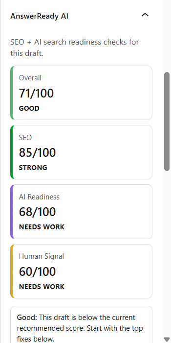
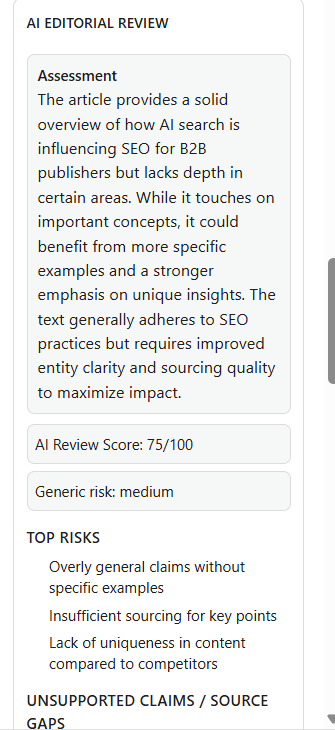
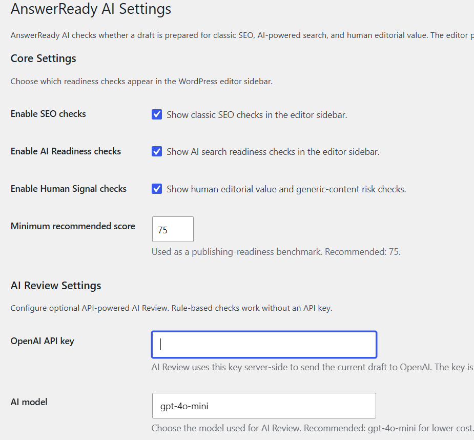
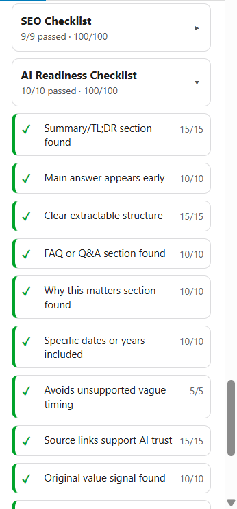

# AnswerReady AI

AnswerReady AI is an open-source WordPress plugin that helps editors check drafts for classic SEO, AI search readiness, and human editorial quality.

## What it does

AnswerReady AI adds a **Gutenberg editor sidebar** panel while you edit a post. It runs rule-based checks in the browser and shows:

- **SEO** score and checklist
- **AI Readiness** score and checklist
- **Human Signal** score and checklist
- **Overall** publishing score
- **Top fixes** for the highest-impact failed checks

When an OpenAI API key is configured, editors can optionally run **AI Review** for a structured editorial assessment and suggested TL;DR, FAQs, and “Why this matters” content.

## Features

- SEO checklist
- AI Readiness checklist
- Human Signal checklist
- Overall publishing score
- Top fixes
- Collapsible checklist sections
- Configurable settings (enable/disable sections, minimum recommended score)
- Minimum recommended score setting
- OpenAI-powered AI Review
- API cost safeguards (confirmation, content-hash cache, reuse saved reviews)
- Cached AI reviews in browser localStorage
- Copy / insert AI suggestions into the draft
- Missing API key handling
- No AI-detection claims

## Who it is for

- Editors and journalists
- Publishers and B2B content teams
- SEO strategists working in WordPress
- Bloggers using the block editor
- Developers and portfolio reviewers evaluating a Gutenberg + REST + settings integration

## Installation

Manual / local install:

1. Download or clone the repository.
2. Copy the `answerready-ai` folder into `wp-content/plugins/`.
3. Activate **AnswerReady AI** in **Plugins**.
4. Open a post in the **block editor** (Gutenberg).

Requirements:

- WordPress with the block editor
- PHP version compatible with your WordPress install
- OpenAI API key only if you use **Run AI Review**

## Configuration

Go to **Settings → AnswerReady AI**:

| Setting | Purpose |
|---------|---------|
| Enable SEO checks | Show or hide the SEO checklist and score |
| Enable AI Readiness checks | Show or hide the AI Readiness checklist and score |
| Enable Human Signal checks | Show or hide the Human Signal checklist and score |
| Minimum recommended score | Publishing-readiness benchmark (default: 75) |
| OpenAI API key | Required for AI Review (server-side only) |
| AI model | OpenAI model ID for AI Review (default: `gpt-4o-mini`) |

Rule-based checks work without an API key.

## Using the editor sidebar

1. Edit a draft in the block editor.
2. Open the **AnswerReady AI** document sidebar panel.
3. Review scores, the recommendation, and **Top fixes**.
4. Expand checklist cards to see individual checks.
5. Optionally run **AI Review** if an API key is saved.

## Using AI Review

- **Rule-based checks** run automatically as you edit.
- **AI Review** is optional and uses your saved OpenAI API key.
- AI Review sends the current draft **title**, **excerpt**, and **content** to OpenAI through your WordPress site’s REST API.
- **Cost safeguards** include a confirmation prompt, content-hash caching, and options to reuse a saved review when the draft has not changed.
- Suggestions can be **copied** or **inserted** as new blocks (TL;DR, FAQ, Why this matters).

Do not use AI Review on confidential drafts unless your organization allows sending that content to OpenAI.

## Screenshots

## Privacy and API use

- Rule-based checks run in the editor without sending draft content to third parties as part of that flow.
- **AI Review** sends title, excerpt, and content to **OpenAI** using the site owner’s API key.
- The API key is stored in WordPress settings and is **not** exposed to browser JavaScript.
- Cached AI reviews may be stored in **browser localStorage** on the editor’s device.

See [PRIVACY.md](PRIVACY.md) for more detail.

## Limitations

- Does **not** guarantee search rankings, AI Overview inclusion, or AI citations.
- Does **not** detect whether text was written by AI.
- Does **not** replace human editing, legal review, or fact-checking.
- Currently supports **OpenAI only** for API-powered review.
- Built for the **Gutenberg / block editor** (not Classic Editor–specific workflows).

## Roadmap

Near-term:

- **v0.8** — Beta testing and hardening
- **v0.9** — GitHub release polish, screenshots, documentation
- **v1.0** — Public open-source release

Future ideas:

- Content-type scoring modes
- Review history per post
- Exportable readiness reports
- Replace existing TL;DR / FAQ / Why this matters sections (optional)
- Bulk article audits
- Additional AI providers

Details: [ROADMAP.md](ROADMAP.md)

## Contributing

Issues, feedback, and pull requests are welcome.

Please open an issue before large changes. Include reproduction steps for bugs.

## License

AnswerReady AI is released under **GPL-2.0-or-later**. See [LICENSE](LICENSE).

## Changelog

See [CHANGELOG.md](CHANGELOG.md).

## Author

Parth Joshi
